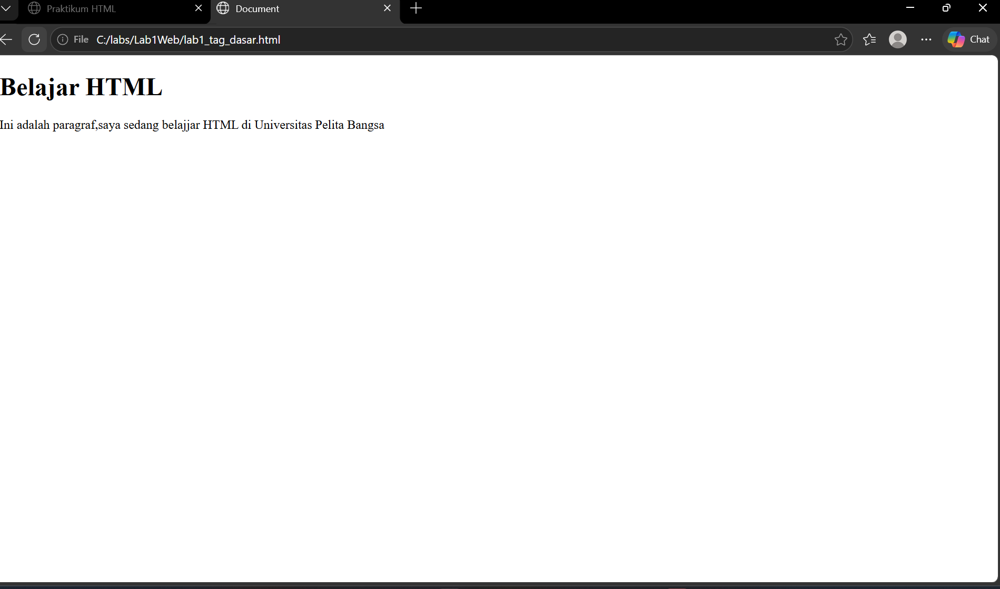

# Lab1Web
## Belajar Tag Dasar HTML

### Membuat Struktur Dasar Dokumen HTML
kode tag untuk paragraf adalah "
"
ini adalah tampilannya

### Membuat paragraf 
Kode untuk membuat paragraf adalah "
"

### Memformat Teks
